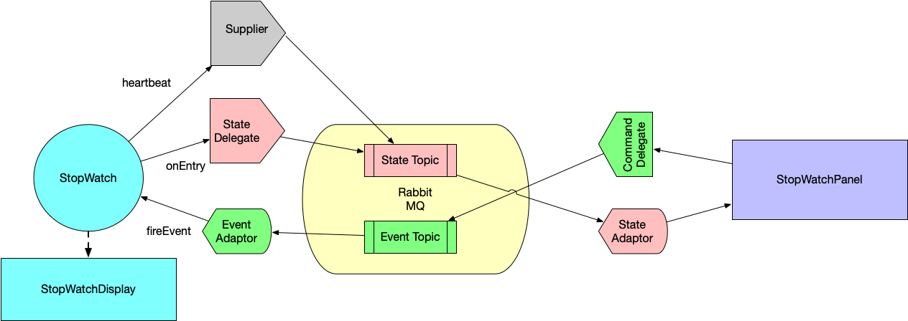

# Demo for Event-driven Microservices

### Demo Architecture

The architecture of this demo is shown as follows.



### Run

You should have docker install to run this demo.

```shell
./start-server.sh

mvn clean install

cd stopwatch
mvn spring-boot:run

cd ../watch-panel
mvn spring-boot:run
```